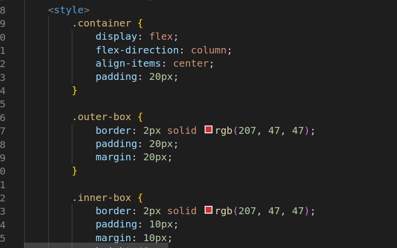
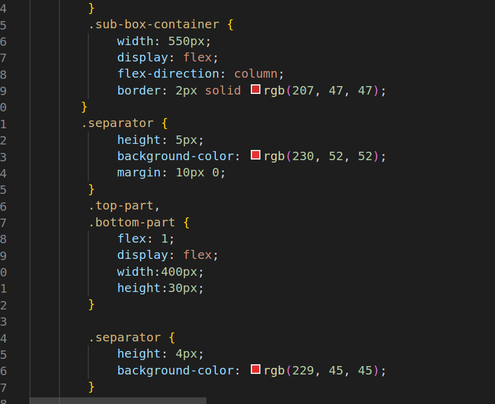

# Box Model
1.
* The div class="container": This is a container that wraps the entire content. It uses Flexbox to center its contents both horizontally and vertically.
* The div class="outer-box": This represents the outermost box with a border. It contains several inner boxes and text.
* The div class="inner-box": These are inner boxes with borders, padding, and margin. They have specified widths, heights, and font sizes.
* The div class="inner-box-2": Similar to the inner boxes but with a different height, font size, and no line spacing.
* The div class="inner-box-3": Another inner box that contains a sub-box container.
8 The div class="sub-box-container": This container holds two parts, both styled as boxes.
* The div class="top-part"and div class="bottom-part": These represent the top and bottom parts of the sub-box container. They have flex properties to divide the container into two equal parts.
* The div class="separator": This is a separator with a red background used to separate the top and bottom parts.
* The div class="flex-row": This is a flex container for arranging items in a row.
* p: These are paragraphs containing text.
* The div class="small-box-1" and div class="small-box-2": These are small boxes with borders, width, height, and text inside them. They are inline-block elements.
* a href="#": This is an anchor (link) element. It is used inside small-box-2 and contains a dummy link.

2.

3.

4.

* container: It uses Flexbox to center its contents both horizontally and vertically within the viewport.
* outer-box: This style defines the outermost box's appearance, including border, padding, and margin.
* inner-box, .inner-box-2, .inner-box-3: These styles define the appearance of inner boxes, including borders, padding, margin, dimensions, font size, and line height.
* sub-box: This style defines the appearance of the sub-boxes inside the "flex-row," including borders, padding, margin, and display as inline-block.
* text: This style defines the margin for text elements.
* flex-row: This style sets display: flex to arrange elements in a row.
* sub-box-container: This style defines the appearance of the sub-box container, including border and display as a flex container with a column layout.
* top-part and .bottom-part: These styles set the list-style type to disc, which adds bullet points to the list items. They also use flex properties to divide the container into two equal parts.
* separator: This style defines the appearance of the separator with a red background.

# Hosted Link
https://nikhitha5511.github.io/BoxModel/?authuser=0
